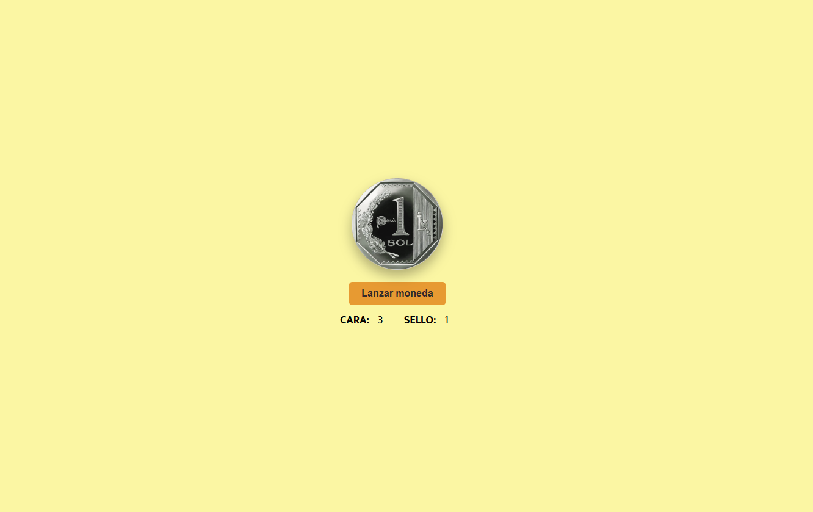

# FlipCoin

Una aplicación web interactiva para lanzar una moneda virtual y realizar un seguimiento de los resultados de "Cara" y "Sello". Este proyecto utiliza HTML, CSS y JavaScript para implementar la funcionalidad y el diseño.

## Características

- **Lanzamiento de moneda**: Simula el lanzamiento de una moneda con una animación en 3D.
- **Contador de resultados**: Lleva un registro de cuántas veces salió "Cara" o "Sello".
- **Diseño responsivo**: Compatible con dispositivos móviles y pantallas de escritorio.

## Vista previa

